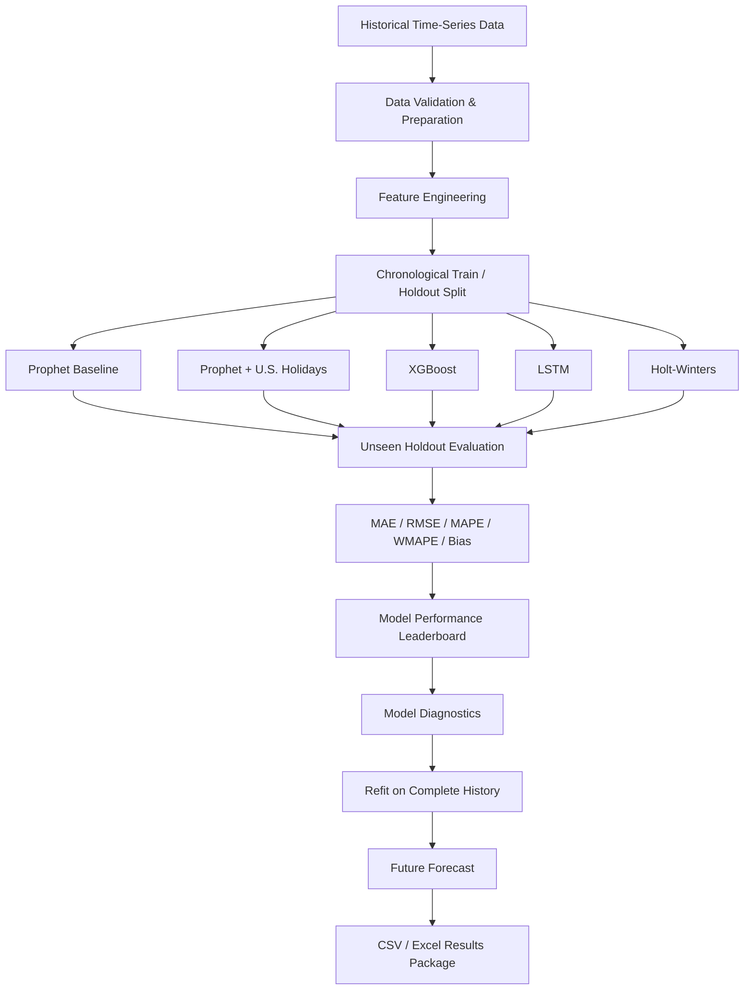

# Multi-Model Demand Forecasting & Validation Studio

<p align="center">
  <strong>A reproducible forecasting workbench for comparing statistical, machine-learning, and deep-learning models on unseen time-series data.</strong>
</p>

<p align="center">
  
  
  
  
  
  
</p>

---

## Overview

**Multi-Model Demand Forecasting & Validation Studio** is an interactive Streamlit application for evaluating multiple forecasting approaches under a common, transparent validation workflow.

The application compares five forecasting engines:

- **Prophet Baseline**
- **Prophet + U.S. Holidays**
- **XGBoost**
- **LSTM**
- **Holt-Winters**

Rather than assuming that one model is always superior, the application evaluates each selected model on an **unseen chronological holdout period**, calculates common forecast-error metrics, ranks successful models, displays model diagnostics, and then refits each model on the complete available history to produce future forecasts.

> **Core principle:** model selection should be supported by out-of-sample evidence, not by model complexity or in-sample fit alone.

---

## What This Project Demonstrates

This project provides an executable workflow for:

| Capability | Implementation |
|---|---|
| Multi-model comparison | Prophet, Prophet + Holidays, XGBoost, LSTM, Holt-Winters |
| Time-aware validation | Chronological train/holdout split |
| Forecast evaluation | MAE, RMSE, MAPE, WMAPE, Bias |
| External drivers | Optional numeric regressors |
| Holiday analysis | U.S. federal holiday alignment |
| Machine learning | Autoregressive XGBoost |
| Deep learning | Stacked LSTM |
| Statistical benchmark | Holt-Winters exponential smoothing |
| Forecast diagnostics | Actual vs. forecast and residual analysis |
| Model ranking | Holdout-performance leaderboard |
| Future forecasting | Refit on complete available history |
| Data-quality controls | Cleaning and preprocessing audit |
| Exportable outputs | CSV and multi-sheet Excel |
| Interactive workflow | Streamlit interface |
| Reproducible demo | Built-in synthetic demand data |

---

## System Workflow



---

## Forecasting Engines

### 1. Prophet Baseline

The baseline Prophet model is designed to represent:

- trend;
- changepoints;
- recurring seasonality; and
- optional numeric regressors.

It provides an interpretable reference model for time series with changing trends and recurring calendar patterns.

---

### 2. Prophet + U.S. Holidays

A second Prophet configuration incorporates aligned **U.S. federal holiday periods**.

The application evaluates the holiday-aware model separately from the baseline model so that the effect of adding holiday information can be measured rather than assumed.

The interface reports whether holiday modeling:

- improves holdout WMAPE;
- increases holdout WMAPE; or
- produces no measurable difference on the selected holdout.

---

### 3. XGBoost Autoregressive Forecasting

The XGBoost implementation converts the time series into a supervised regression problem.

The feature set can include:

- lagged target values;
- rolling mean;
- rolling standard deviation;
- year;
- quarter;
- month;
- ISO week;
- day of week;
- day of month;
- day of year;
- hour;
- weekend indicator;
- cyclical calendar encodings;
- U.S. holiday indicator; and
- optional numeric drivers.

#### Recursive Forecasting

For multi-period prediction, the model does not use unknown future target values.

```text
Known History
     │
     ▼
Predict t+1
     │
     ▼
Append Prediction
     │
     ▼
Use Updated History
     │
     ▼
Predict t+2
     │
     ▼
Continue Through Horizon
```

This mirrors the constraint encountered in real forecasting situations, where future actual demand is unavailable when the forecast is generated.

---

### 4. LSTM Neural-Network Forecasting

The project includes an LSTM forecasting implementation using TensorFlow/Keras.

The current network contains:

```text
Input Sequence
     │
     ▼
LSTM Layer
     │
     ▼
Dropout
     │
     ▼
LSTM Layer
     │
     ▼
Dropout
     │
     ▼
Dense Layer
     │
     ▼
Forecast
```

The implementation includes:

- configurable sequence lookback;
- feature scaling;
- stacked LSTM layers;
- dropout regularization;
- dense layers;
- Adam optimization;
- early stopping;
- deterministic random-seed configuration; and
- recursive multi-period forecasting.

The LSTM is trained separately for holdout validation and then refit using the full available history before generating future forecasts.

---

### 5. Holt-Winters

Holt-Winters exponential smoothing provides a transparent statistical benchmark.

Depending on the amount of available history, the implementation can model:

- level;
- trend;
- damped trend; and
- additive seasonality.

Including a conventional statistical benchmark helps determine whether more complex methods actually improve out-of-sample performance for a given dataset.

---

## Data Preparation

Before model execution, the application prepares the uploaded time series through a repeatable workflow.

It can:

1. parse the selected timestamp column;
2. convert the selected target to numeric format;
3. remove unusable timestamp and target records;
4. aggregate duplicate timestamps;
5. create a complete time index;
6. insert missing time periods;
7. apply the selected missing-value treatment;
8. validate optional numeric drivers; and
9. report the preprocessing activity.

### Supported Missing-Value Treatments

- Time interpolation
- Forward fill
- Fill with zero

### Data-Quality Audit

The application reports:

```text
Invalid Dates Removed
Invalid Targets Removed
Duplicate Timestamps Aggregated
Missing Periods Inserted
```

This makes preprocessing decisions visible rather than silently modifying the input data.

---

## Supported Time Frequencies

The application supports:

| Frequency | Default Seasonal Cycle |
|---|---:|
| Hourly | 24 |
| Daily | 7 |
| Weekly | 52 |
| Monthly | 12 |

The seasonal-cycle setting is configurable because actual seasonality depends on the dataset and use case.

---

## Optional Demand Drivers

The application can incorporate additional numeric variables alongside the historical target.

Examples include:

- promotion;
- price;
- availability;
- subscribers;
- media activity;
- weather; or
- other measurable numeric drivers.

For future periods, driver values are unknown unless separately supplied or forecast. The current application therefore makes the assumption explicit and supports:

- **Carry last observed value**
- **Repeat last seasonal cycle**

These assumptions are part of the forecast configuration and should be considered when interpreting future results.

---

## Chronological Holdout Validation

The validation design preserves the order of time.

```text
Past                                                    Present
│                                                         │
├──────────────── Training Period ─────────────────────────┤
                                                          │
                                                          ├── Holdout ──┤
```

The selected models are trained only on the training portion.

They then forecast the unseen holdout portion.

Predictions are compared against actual holdout observations using the same set of evaluation metrics.

Only after validation does the application refit a successful model using the complete available history to generate a future forecast.

This separates:

```text
Model Evaluation
       ↓
Model Comparison
       ↓
Full-History Refit
       ↓
Future Forecast
```

---

## Evaluation Metrics

### MAE — Mean Absolute Error

Measures the average absolute distance between actual and predicted values.

### RMSE — Root Mean Squared Error

Places greater weight on relatively large forecast errors.

### MAPE — Mean Absolute Percentage Error

Expresses forecast error as a percentage for observations where percentage calculation is valid.

### WMAPE — Weighted Mean Absolute Percentage Error

```text
           Σ |Actual - Forecast|
WMAPE = --------------------------- × 100
               Σ |Actual|
```

### Bias

Measures the average signed forecasting error and helps identify systematic over-forecasting or under-forecasting.

### WMAPE Accuracy Score

For application readability, the interface also displays:

```text
WMAPE Accuracy Score = max(0, 100 - WMAPE)
```

This is an application-defined interpretation of WMAPE and is **not presented as a universal statistical definition of forecast accuracy**.

---

## Model Performance Leaderboard

Successfully completed models are ranked using holdout performance.

The application primarily ranks models by **WMAPE**, with **MAE** used as an additional sorting criterion.

Example structure:

| Rank | Model | MAE | RMSE | MAPE | WMAPE | Bias |
|---:|---|---:|---:|---:|---:|---:|
| 1 | Best-performing model | — | — | — | — | — |
| 2 | Model | — | — | — | — | — |
| 3 | Model | — | — | — | — | — |
| 4 | Model | — | — | — | — | — |
| 5 | Model | — | — | — | — | — |

No fixed performance result is claimed in this README.

Actual results depend on the dataset, holdout period, forecast horizon, selected variables, and model configuration used in a particular run.

---

## Model Diagnostics

For each successfully completed model, the application displays:

- MAE;
- RMSE;
- MAPE;
- WMAPE;
- bias;
- actual vs. forecast visualization;
- holdout residuals;
- holdout predictions;
- future predictions; and
- model-specific notes.

### Forecast Intervals

Prophet uses its model-generated prediction intervals.

For XGBoost, LSTM, and Holt-Winters, the current implementation uses approximate **90% residual-based ranges**.

These ranges are intended as diagnostics and should not be interpreted as equivalent probabilistic uncertainty estimates across all model families.

---

## Holiday-Impact Evaluation

When both Prophet variants are selected, the application directly compares:

```text
Prophet Baseline
       vs.
Prophet + U.S. Holidays
```

The interface compares holdout WMAPE and MAE and reports whether the holiday-aware configuration improved, worsened, or matched the baseline result on that dataset.

This design treats holiday effects as an empirical question rather than an assumed improvement.

---

## Built-In Demonstration Data

A reproducible synthetic dataset is included within the application.

The generated series contains:

- trend;
- weekly seasonality;
- annual seasonality;
- promotional events;
- price-index variation;
- U.S. federal-holiday effects; and
- random demand variation.

A fixed random seed is used to make the demonstration repeatable.

> **Important:** the built-in dataset is synthetic. It does not represent proprietary employer, customer, carrier, or operational data.

---

## Input Data

The application accepts:

- `.csv`
- `.xlsx`
- `.xls`

At minimum, the data should contain:

```text
date | target
```

Example:

```text
2026-01-01 | 1050
2026-01-02 | 1110
2026-01-03 | 1084
```

Optional numeric drivers can also be included:

```text
date | demand | promotion | price | availability
```

---

## Application Workflow

```text
1. Load a dataset
        ↓
2. Select timestamp column
        ↓
3. Select target column
        ↓
4. Select optional numeric drivers
        ↓
5. Choose data frequency
        ↓
6. Configure data preparation
        ↓
7. Define forecast horizon
        ↓
8. Define chronological holdout
        ↓
9. Configure seasonal / model parameters
        ↓
10. Select forecasting engines
        ↓
11. Run forecasts
        ↓
12. Compare holdout performance
        ↓
13. Review diagnostics
        ↓
14. Export future forecasts and model results
```

---

## Exported Results

The application can generate two downloadable result packages.

### Combined Forecast CSV

```text
combined_future_forecast.csv
```

Contains future point forecasts from the successfully completed models.

### Complete Excel Package

```text
forecasting_intelligence_results.xlsx
```

Contains:

- model leaderboard;
- validation output for each successful model; and
- future forecast output for each successful model.

These exports make the model outputs easier to inspect, preserve, and compare outside the Streamlit interface.

---

## Project Files

For the current application, a clean repository can use the following minimal structure:

```text
Multi-Model-Demand-Forecasting-Validation-Studio/
│
├── app.py
├── README.md
├── requirements.txt
│
├── screenshots/
│   ├── data-readiness.png
│   ├── model-leaderboard.png
│   ├── forecast-comparison.png
│   ├── holiday-impact.png
│   └── model-diagnostics.png
│
└── results/
    ├── combined_future_forecast.csv
    └── forecasting_intelligence_results.xlsx
```

> Only include `screenshots/` and `results/` files that were actually generated from working application runs. Do not add placeholder results as though they were measured outputs.

---

## Installation

### 1. Clone the repository

```bash
git clone <your-repository-url>
cd Multi-Model-Demand-Forecasting-Validation-Studio
```

### 2. Create a virtual environment

**Windows**

```bash
python -m venv .venv
.venv\Scripts\activate
```

**macOS / Linux**

```bash
python3 -m venv .venv
source .venv/bin/activate
```

### 3. Install dependencies

```bash
python -m pip install -r requirements.txt
```

A compatible `requirements.txt` should include the packages used by the application, such as:

```text
streamlit
numpy
pandas
plotly
scikit-learn
prophet
statsmodels
xgboost
tensorflow
openpyxl
```

---

## Run the Application

If the main application file is named `app.py`:

```bash
streamlit run app.py
```

or:

```bash
python -m streamlit run app.py
```

If you retain a different Python filename, replace `app.py` with that filename.

---

## Reproducibility

For any result that is retained, shared, or cited, preserve the corresponding run configuration.

Recommended information includes:

```text
Dataset / Dataset Version
Historical Date Range
Data Frequency
Target Variable
Selected Drivers
Missing-Value Strategy
Holdout Percentage
Forecast Horizon
Seasonal Period
Lookback Window
Prophet Parameters
XGBoost Parameters
LSTM Parameters
Software / Package Versions
Execution Date
Model Leaderboard
Validation Predictions
Future Forecast
```

This creates a transparent chain between:

```text
Input Data
    ↓
Configuration
    ↓
Forecasting Method
    ↓
Validation
    ↓
Measured Result
```

---

## Intended Use

This project is designed as a **forecasting experimentation, benchmarking, and decision-support prototype**.

It can be adapted to different demand-planning environments where historical time-series data is available.

One possible application area is telecommunications demand planning, including analysis of device, SIM, equipment, regional, or channel demand. However, this repository itself does **not** claim carrier deployment, production adoption, or validation on proprietary telecommunications data unless such evidence is separately documented.

---

## Current Scope

The current application implements:

- time-series ingestion;
- data preparation;
- optional external drivers;
- five forecasting approaches;
- chronological holdout testing;
- recursive XGBoost forecasting;
- recursive LSTM forecasting;
- common forecast metrics;
- model ranking;
- residual diagnostics;
- holiday-effect comparison;
- full-history refitting;
- future forecasting; and
- CSV/Excel export.

---

## Current Limitations

The following limitations are intentionally documented to distinguish demonstrated functionality from possible future extensions.

- The application currently uses a **single configurable chronological holdout**, not rolling-origin cross-validation.
- Model performance is **dataset-dependent**.
- No model is assumed to be universally superior.
- Future external-driver values rely on an explicit assumption unless independently supplied.
- XGBoost, LSTM, and Holt-Winters intervals are approximate residual-based ranges.
- LSTM may require substantially more computation than the other models, particularly on CPU-only systems.
- The built-in demonstration is synthetic and is not evidence of operational deployment.
- This repository does not, by itself, establish business impact, industry adoption, or deployment at organizational scale.
- Operational use would require appropriate data governance, security controls, monitoring, retraining policies, domain review, and additional validation.

---

## Potential Extensions

Potential future work may include:

- seasonal-naive benchmark;
- rolling-origin backtesting;
- automated hyperparameter tuning;
- probabilistic forecasting;
- hierarchical forecasting;
- multi-SKU forecasting;
- multi-location forecasting;
- intermittent-demand methods;
- model drift monitoring;
- automated retraining;
- scenario forecasting; and
- integration with downstream inventory or decision-support systems.

These are **future extensions**, not claims about functionality already demonstrated in the current version.

---

## Responsible Use

Forecasts are decision-support estimates, not guaranteed future outcomes.

Before operational use, forecasting models should be evaluated using:

- representative domain data;
- appropriate baseline models;
- multiple historical validation periods where feasible;
- realistic assumptions for future drivers;
- domain or business review;
- ongoing performance monitoring; and
- drift detection.

Results should be interpreted only within the dataset, configuration, and validation conditions under which they were generated.

---

## Data & Privacy

Public repositories should contain only:

- synthetic data;
- public data; or
- data authorized for public distribution.

Do not publish:

- confidential employer data;
- customer information;
- proprietary carrier information;
- personally identifiable information;
- trade secrets; or
- restricted operational datasets.

---

## Author

**Lakshmanaprakash Murugesan**

Focus areas:

`Demand Forecasting` · `Machine Learning` · `Data Engineering` · `Supply-Chain Analytics` · `Decision Intelligence`

---

## Disclaimer

This repository is an engineering and research prototype for forecasting experimentation and model comparison.

The built-in demonstration data is synthetic. Forecast performance, model ranking, and model behavior depend on the dataset, selected configuration, validation period, and forecast horizon.

No result should be generalized beyond the conditions under which it was measured, and no operational, commercial, or industry-scale impact is claimed unless supported by separate, verifiable evidence.
