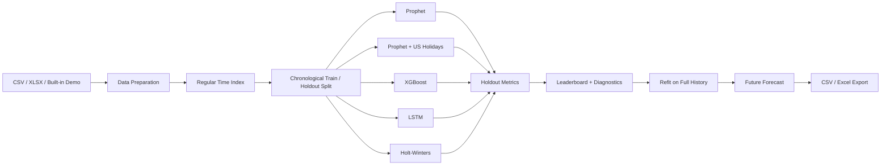

# Technical Architecture

## Current implemented boundary

The existing application accepts one timestamped business time series, optional numeric drivers, a selected data frequency, and a common chronological holdout configuration. It then evaluates selected forecasting models, reports common metrics, visualizes diagnostics, refits successful models on full history, and exports future forecasts.

## Implemented engineering controls

- chronological rather than random holdout;
- common evaluation metrics across model families;
- recursive multi-step forecasting for XGBoost and LSTM;
- optional numeric regressors;
- explicit U.S. holiday comparison;
- regular-frequency data preparation and duplicate handling;
- result exports for review outside the UI;
- fixed random-seed settings where supported.

## Not implemented in the unchanged source

- rolling-origin / walk-forward cross-validation;
- seasonal-naive benchmark;
- automatic multi-SKU / multi-region orchestration;
- hierarchical reconciliation;
- calibrated probabilistic forecasts;
- downstream MEIO execution interface;
- production monitoring / drift / automated retraining.

These are documented as future extensions rather than represented as current capabilities.
